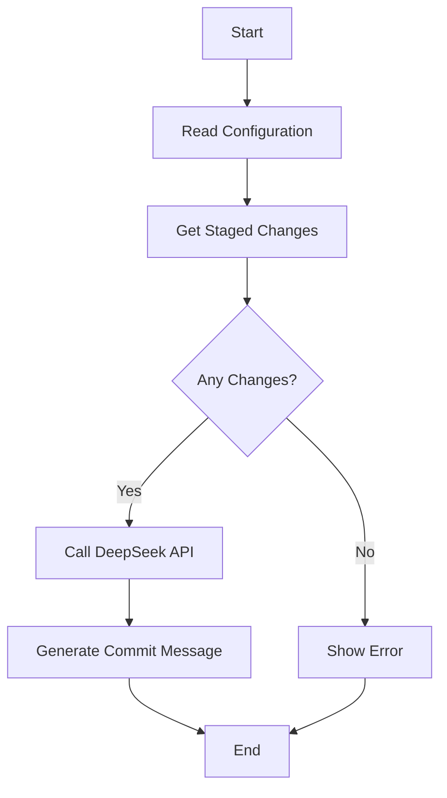

# 🚀 Git Commit Generator

<div align="center">


[](README.md)
[](README_CN.md)

</div>

🤖 Automatically generate high-quality Git commit messages powered by AI

## ✨ Features

- 🔍 Automatically analyze staged Git changes

- 📝 Generate semantic commit messages using DeepSeek AI

- 🎨 Support for multiple commit message formats (Conventional, Bracketed, etc.)

- ⚙️ Configurable AI model parameters

- 🚀 Simple and easy-to-use command line interface

## 📋 Prerequisites

- 💻 Rust and Cargo installed

- 🔑 DeepSeek API key

- 📦 Git

### 🛠️ Installation

#### From source

```shell
# Clone the repository
git clone https://github.com/Emin017/git-commit-generator.git
# Change to the project directory
cd git-commit-generator
# Build the binary
cargo build --release
# Install the binary
cargo install --path .
# Run the binary
git-commit-generator --help
```

#### Using Nix

```shell
nix run github:Emin017/git-commit-generator#git-commit-generator
```

## ⚙️ Configure DeepSeek API Key

Create a .env file in your project directory:
```
DEEPSEEK_API_KEY=your_api_key_here
```

## 🚀 Usage

```shell
# Add files to commit
git add .

# Generate commit message
git-commit-generator

# Use different commit format
git-commit-generator --format conventional

# Use different model
git-commit-generator --model deepseek-coder
```

### 💡 Available Options

| Option | Short | Description | Default |
| --- | --- | --- | --- |
| --format | -f | Commit message format | conventional |
| --model | -m | DeepSeek model | deepseek-chat |

### 📝 Commit Message Formats

Supported formats include:

- Conventional: `feat: add new feature`

- Bracketed: `[feat]: add new feature`

- Plain: `add new feature`

### 🔄 Workflow



## 🛡️ License


## 🙏 Acknowledgments

Thanks to DeepSeek AI for providing powerful AI models and the Rust community for excellent development tools and libraries!

## 🤝 Contributions
Contributions are welcome! Feel free to submit [Issues](https://github.com/Emin017/git-commit-generator/issues) and [Pull Requests](https://github.com/Emin017/git-commit-generator/pulls)!
