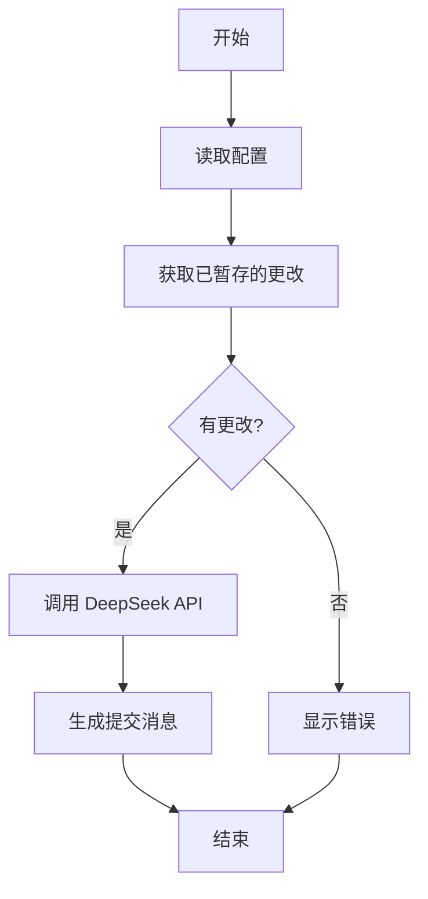

# 🚀 Git Commit Generator

<div align="center">


📝 [中文介绍](README_CN.md) | 📝 [English README](README.md)

</div>

🤖 借助 AI 的力量，自动生成高质量的 Git 提交信息

## ✨ 功能特点

- 🔍 自动分析已暂存的 Git 更改

- 📝 使用 DeepSeek AI 生成语义化提交消息

- 🎨 支持多种提交消息格式 (Conventional, Bracketed 等)

- ⚙️ 可配置的 AI 模型参数

- 🚀 简单易用的命令行界面

## 📋 前提条件

- 💻 已安装 Rust 及 Cargo

- 🔑 DeepSeek API 密钥

- 📦 Git

### 🛠️ 安装方法

#### 从源码安装

```shell
# 克隆仓库
git clone https://github.com/Emin017/git-commit-generator.git
# 进入项目目录
cd git-commit-generator
# 构建二进制文件
cargo build --release
cargo install --path .
# 运行二进制文件
git-commit-generator --help
```

#### 使用 Nix

```shell
# 使用 Nix 构建
nix build .#git-commit-generator
# 运行二进制文件
./result/bin/git-commit-generator --help
```

## ⚙️ 配置 DeepSeek API 密钥

创建一个 .env 文件在项目目录中:
```
DEEPSEEK_API_KEY=your_api_key_here
```

## 🚀 使用方法

```shell
# 添加要提交的文件
git add .

# 生成提交信息
git-commit-generator

# 使用不同的提交格式
git-commit-generator --format conventional

# 使用不同的模型
git-commit-generator --model deepseek-coder
```

### 💡 可用选项

| 选项 | 简写 | 描述 | 默认值 |
| --- | --- | --- | --- |
| --format | -f | 提交消息格式 | conventional |
| --model | -m | DeepSeek | 模型 | deepseek-chat |

### 📝 提交消息格式

支持的格式包括:

- Conventional: `feat: add new feature`

- Bracketed: `[feat]: add new feature`

- Plain: `add new feature`

### 🔄 工作流程



## 🛡️ 许可证


## 🙏 致谢

感谢 DeepSeek AI 提供强大的 AI 模型支持以及 Rust 社区提供优秀的开发工具和库!!

## 🤝 贡献
欢迎提交 [Issues](https://github.com/Emin017/git-commit-generator/issues) 和 [Pull Requests](https://github.com/Emin017/git-commit-generator/pulls)!
